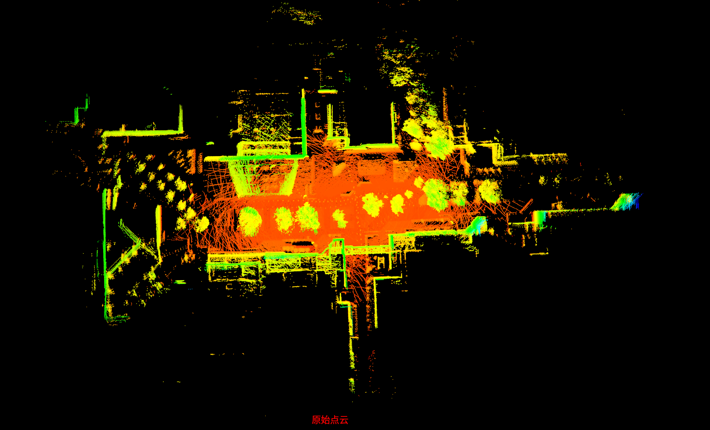
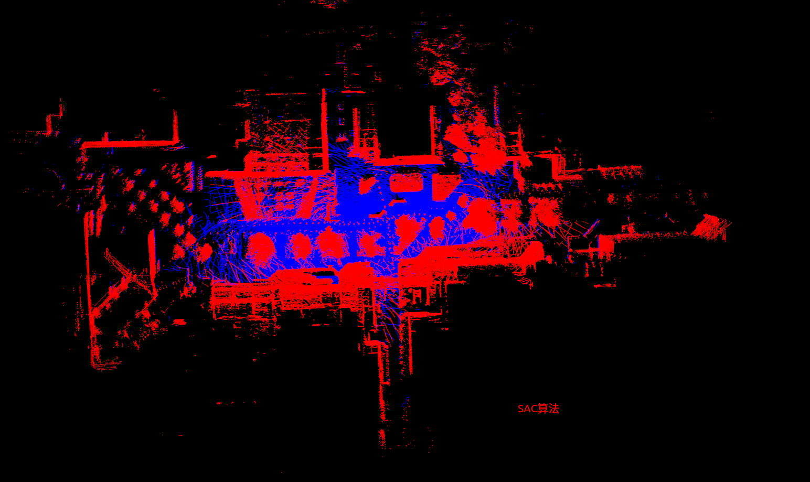
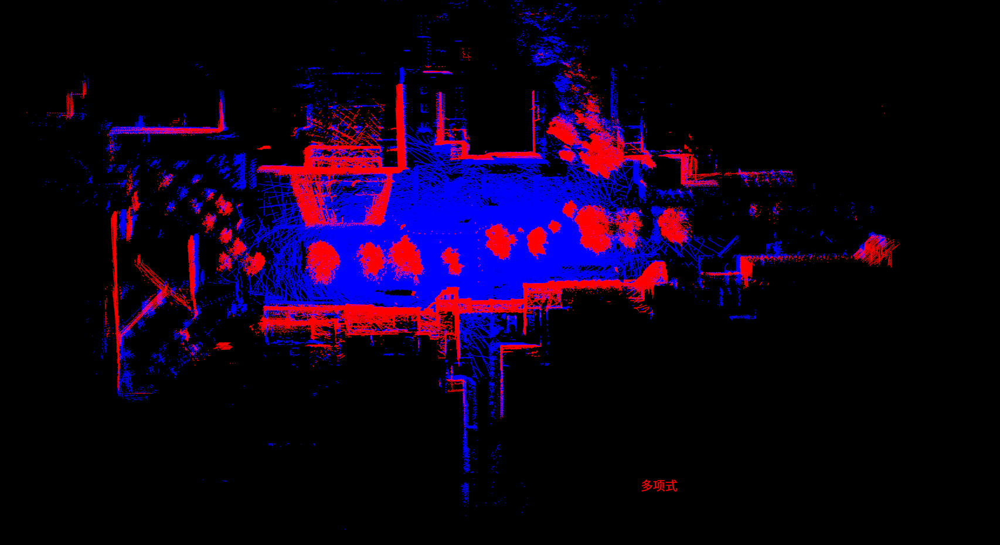
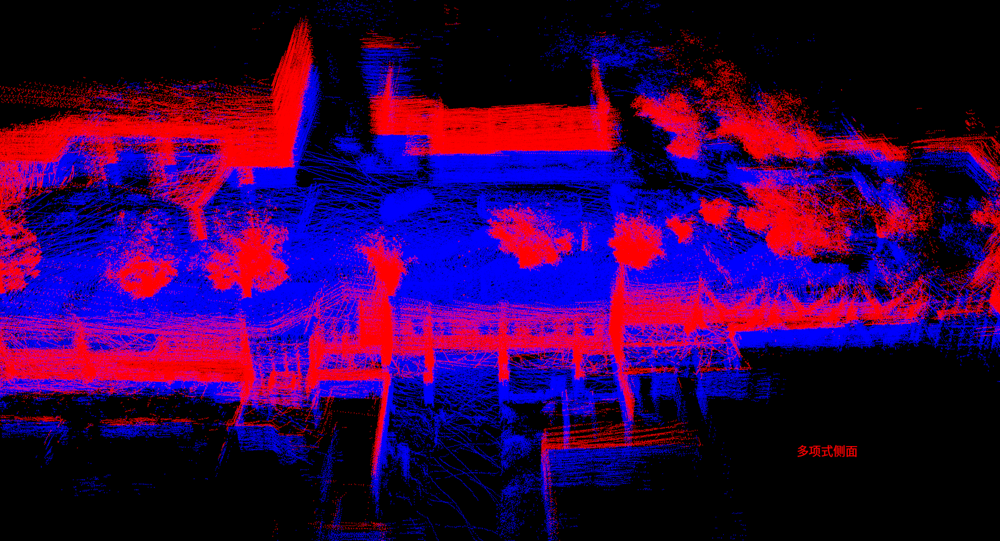

## ground surface estimation   

The LiDAR data and map data are sourced from the project: [hdl_localization][1]

Algorithm reference for this excellent project: [pointcloud_surface][2]

## Introduction to Code Structure
### Structure
```bash
-- cmake
​	# find third party as ${ThirdParty}.
-- config
	# save config yaml for system.
-- data
	# save examples point cloud map.
-- src
	# ground estimate
​	-- algorithm
		# surface estimate algorithm.
​	-- common
		# universal tools, struct, types for all project.
-- test
	# Specific usage for ground surface estimate.
```


## Requirements

***ground surface estimation*** requires the following libraries:

- PCL
- Eigen3
- glog gflags
- yaml-cpp
- ceres


## Installation

```bash
git clone https://github.com/ZYCheng1002/ground_surface_estimation.git
./build_thirdparty.sh
mkdir build && cd build
cmake ..
make -j8
```


## Evaluation

- Original point cloud visualization



- Ground fitting using SAC algorithm




- Ground fitting using polynominal(ceres)






## Task List

- [ ] Overall universal structure
- [ ]  
- [ ] Adapt Docker


[1]: https://github.com/koide3/hdl_localization
[2]: https://github.com/KIT-MRT/pointcloud_surface